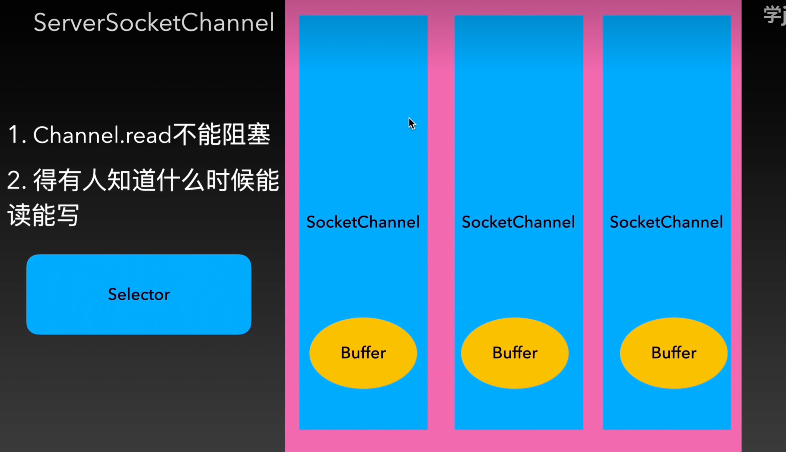
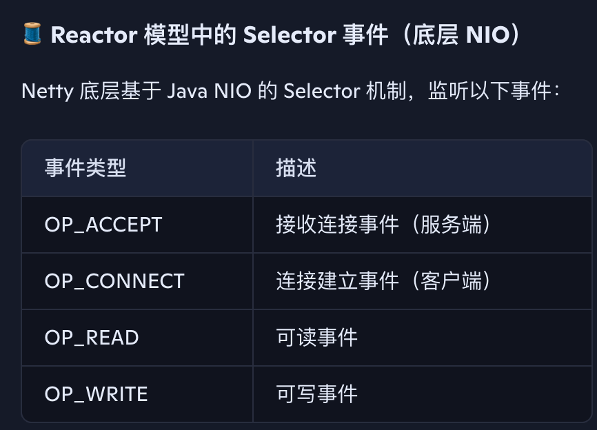
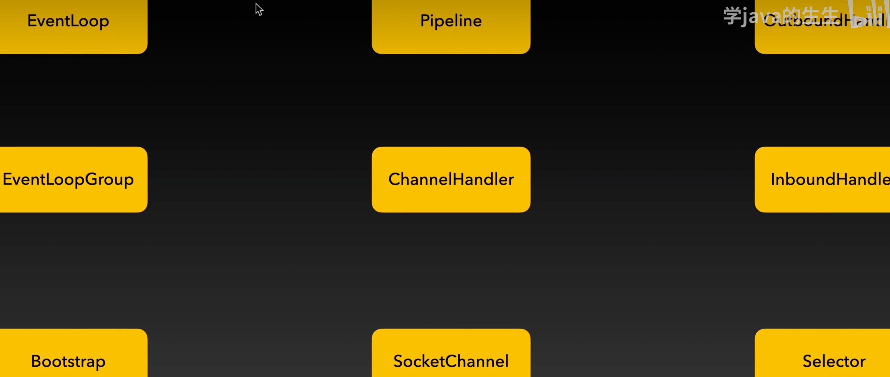
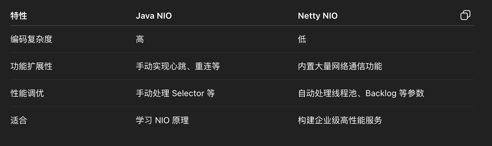
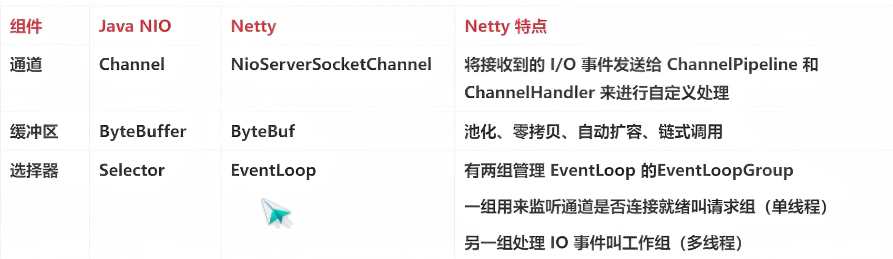
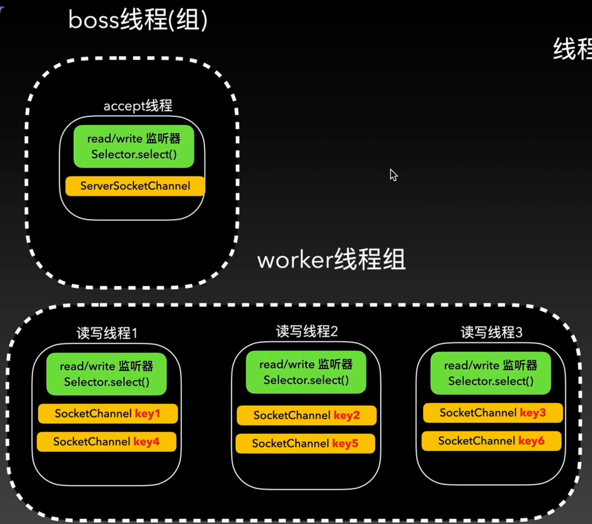

# Netty-QuickStudy
this is my quick study netty project

NIO的三大组件： channel buffer selector
1. channel: 就是我们建立的连接，也就是一个一个的通道
2. buffer: 就是通道上面传递的数据
3. selector: 监听通道的变化，什么时候可以读？什么时候可以写

netty所有组件

netty关键组件：
1. pipeline
2. eventLoop 
3. eventLoop Group
4. pipeline 中的handler

bootstrap 组件将上面的组件组合起来完成通信

